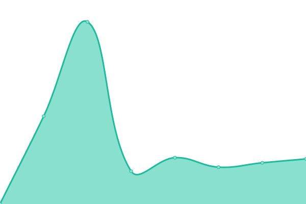
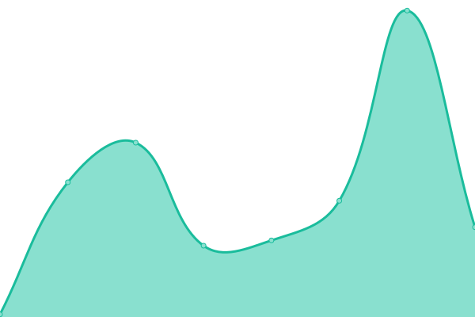
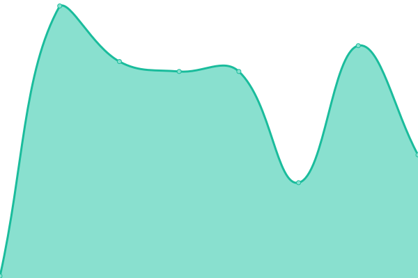
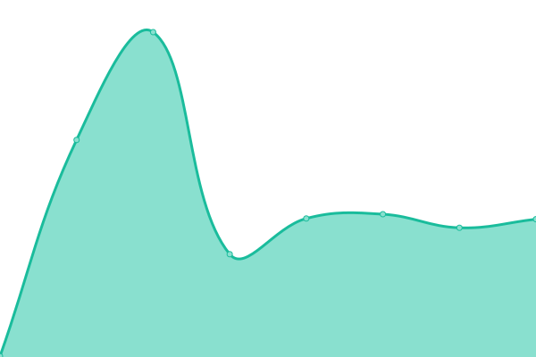

# [📈 Live Status](https://https://exchanges.chain.courses/): <!--live status--> **🟧 Partial outage**

This repository contains the open-source uptime monitor and status page for [James Gan](http://bellevue.tech), powered by [Upptime](https://github.com/upptime/upptime).

With [Upptime](https://upptime.js.org), you can get your own unlimited and free uptime monitor and status page, powered entirely by a GitHub repository. We use [Issues](https://github.com/jamesylgan/exchanges/issues) as incident reports, [Actions](https://github.com/jamesylgan/exchanges/actions) as uptime monitors, and [Pages](https://https://exchanges.chain.courses/) for the status page.

<!--start: status pages-->
<!-- This summary is generated by Upptime (https://github.com/upptime/upptime) -->
<!-- Do not edit this manually, your changes will be overwritten -->
<!-- prettier-ignore -->
| URL | Status | History | Response Time | Uptime |
| --- | ------ | ------- | ------------- | ------ |
|  [PayPal](https://paypal.com) | 🟩 Up | [pay-pal.yml](https://github.com/chain-courses/exchanges/commits/HEAD/history/pay-pal.yml) | 

 970ms
     
 | 

<a href="https://exchanges.chain.courses/history/pay-pal">100.00%</a>
    

|  [Coinbase](https://www.coinbase.com) | 🟥 Down | [coinbase.yml](https://github.com/chain-courses/exchanges/commits/HEAD/history/coinbase.yml) | 

 65ms
     
 | 

<a href="https://exchanges.chain.courses/history/coinbase">100.00%</a>
    

|  [Kraken](https://www.kraken.com/en-us/) | 🟥 Down | [kraken.yml](https://github.com/chain-courses/exchanges/commits/HEAD/history/kraken.yml) | 

 106ms
     
 | 

<a href="https://exchanges.chain.courses/history/kraken">100.00%</a>
    

|  [Bittrex](https://bittrex.com/) | 🟩 Up | [bittrex.yml](https://github.com/chain-courses/exchanges/commits/HEAD/history/bittrex.yml) | 

 234ms
     
 | 

<a href="https://exchanges.chain.courses/history/bittrex">100.00%</a>
    

<!--end: status pages-->

[**Visit our status website →**](https://https://exchanges.chain.courses/)

## 📄 License

- Powered by: [Upptime](https://github.com/upptime/upptime)
- Code: [MIT](./LICENSE) © [James Gan](http://bellevue.tech)
- Data in the `./history` directory: [Open Database License](https://opendatacommons.org/licenses/odbl/1-0/)
